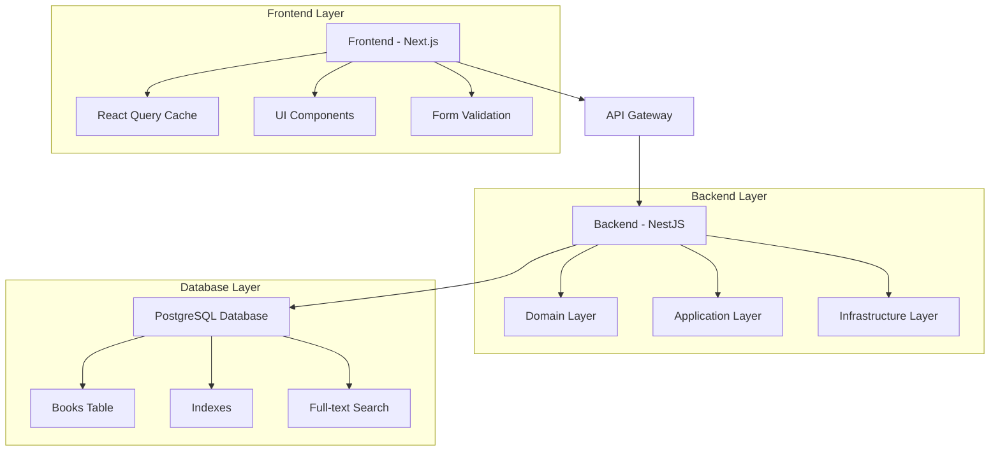

# Bookstore Application

A full-stack, enterprise-scale bookstore application built with modern technologies, optimized for **10+ million book records**. Features NestJS backend with hexagonal architecture and Next.js frontend.

## 🚀 Features

### Backend (NestJS)

- ✅ **Hexagonal Architecture** for maintainable, testable code
- ✅ **Enterprise Security** with input validation, rate limiting, and signed cursors
- ✅ **Cursor-based Pagination** supporting millions of records
- ✅ **Advanced Search** with full-text search and multiple filters
- ✅ **PostgreSQL** with optimized indexes for fast queries
- ✅ **Swagger Documentation** for comprehensive API docs
- ✅ **TDD Approach** with Vitest testing framework
- ✅ **Docker Support** for easy deployment

### Frontend (Next.js)

- ✅ **Modern React** with TypeScript and Next.js 15
- ✅ **Responsive Design** with Tailwind CSS and Radix UI
- ✅ **React Query** for efficient data management and caching
- ✅ **Form Validation** with React Hook Form and Zod
- ✅ **Accessibility** compliant with WCAG guidelines
- ✅ **Real-time Search** with debounced input and filters

### Database & Security

- ✅ **Enterprise-Scale Optimization** for 10+ million records
- ✅ **Dual Primary Key Strategy** - Sequential ID + UUID
- ✅ **Advanced Indexing** - Trigram, GIN, composite, and partial indexes
- ✅ **Enterprise Security** - Input validation, rate limiting, signed cursors
- ✅ **Zero-Downtime Migrations** with backward compatibility

## 🏗️ Architecture

### System Overview



### Technology Stack

| Layer                | Technology                   | Purpose                                    |
| -------------------- | ---------------------------- | ------------------------------------------ |
| **Frontend**         | Next.js 15 + TypeScript      | React framework with SSR support           |
| **UI Library**       | Tailwind CSS + Radix UI      | Styling and accessible components          |
| **State Management** | React Query                  | Data fetching and caching                  |
| **Form Handling**    | React Hook Form + Zod        | Form validation and submission             |
| **Backend**          | NestJS + Fastify             | Scalable Node.js API framework             |
| **Architecture**     | Hexagonal (Ports & Adapters) | Clean, testable architecture               |
| **Database**         | PostgreSQL 15                | Relational database with advanced features |
| **Query Builder**    | Knex.js                      | SQL query builder                          |
| **Testing**          | Vitest + Jest                | Unit and integration testing               |
| **Documentation**    | Swagger/OpenAPI              | API documentation                          |
| **Containerization** | Docker + Docker Compose      | Development and deployment                 |

## 📊 Performance & Security

### Core Features
- **Database Records**: Production-tested with 10+ million records
- **Search Performance**: Fast partial text matching and full-text search
- **Pagination**: O(1) performance with signed cursor-based pagination
- **Security**: Comprehensive input validation, rate limiting, and attack prevention
- **Concurrent Users**: Handles thousands of concurrent requests

### Database Architecture
- **Dual Primary Key**: BIGINT sequential + UUID for performance and compatibility
- **Specialized Indexes**: Trigram, covering, and partial indexes for optimal queries
- **Materialized Full-Text Search**: Pre-computed search vectors with auto-maintenance
- **Secure Queries**: Parameterized queries prevent injection attacks

## 🛠️ Quick Start

### Prerequisites

- Node.js 20+
- PostgreSQL 15+
- Docker & Docker Compose
- pnpm 9.15+

### Development Setup

1. **Clone the repository**:

   ```bash
   git clone <repository-url>
   cd book-store-and-search
   ```

2. **Start with Docker (Recommended)**:

   ```bash
   # Start all services including database
   docker-compose -f docker-compose.yml -f docker-compose.dev.yml up

   # Run database migrations
   docker-compose exec backend pnpm migrate
   ```

3. **Or run locally**:

   ```bash
   # Start PostgreSQL
   docker-compose up postgres -d

   # Backend setup
   cd backend
   pnpm install
   cp .env.example .env
   pnpm migrate
   pnpm start:dev

   # Frontend setup (new terminal)
   cd frontend
   pnpm install
   cp .env.example .env.local
   pnpm dev
   ```

4. **Access the application**:
   - Frontend: http://localhost:3000
   - Backend API: http://localhost:3001
   - API Documentation: http://localhost:3001/docs

### Production Deployment

```bash
# Build and start all services
docker-compose up -d

# Run migrations
docker-compose exec backend pnpm migrate
```

## 📚 API Documentation

### Core Endpoints

| Method   | Endpoint        | Description                        |
| -------- | --------------- | ---------------------------------- |
| `POST`   | `/books`        | Create a new book                  |
| `GET`    | `/books/search` | Search books with advanced filters |
| `GET`    | `/books/:id`    | Get book by ID                     |
| `PUT`    | `/books/:id`    | Update book                        |
| `DELETE` | `/books/:id`    | Delete book                        |

### Example API Usage

```bash
# Create a book
curl -X POST http://localhost:3001/books \
  -H "Content-Type: application/json" \
  -d '{
    "title": "The Great Gatsby",
    "author": "F. Scott Fitzgerald",
    "isbn": "978-0-7432-7356-5",
    "pages": 180,
    "rating": 4.5
  }'

# Search with filters
curl "http://localhost:3001/books/search?search_query=gatsby&min_rating=4&sort_by=rating&sort_order=desc"

# Paginated search
curl "http://localhost:3001/books/search?limit=10&cursor=eyJjcmVhdGVkX2F0IjoiMjAyNCJ9"
```

### Search Parameters

- `title` / `author` - Fast partial text matching with trigram indexes
- `min_rating` / `max_rating` - Rating range filter (1.0-5.0)
- `search_query` - Full-text search with materialized search vectors
- `limit` - Results per page (default: 10, max: 100)
- `cursor` - Signed cursor pagination for security and performance
- `sort_by` / `sort_order` - Flexible sorting with optimized indexes

## 🧪 Testing

### Backend Testing

```bash
cd backend
pnpm test           # Run all tests
pnpm test --watch   # Watch mode
pnpm test:types     # Type checking
```

### Frontend Testing

```bash
cd frontend
pnpm test           # Run all tests
pnpm test --watch   # Watch mode
pnpm test:types     # Type checking
```

### Test Coverage

- **Backend**: Unit tests for domain logic, integration tests for APIs
- **Frontend**: Component tests, user interaction tests, accessibility tests
- **TDD Approach**: Tests written before implementation

## 📖 Documentation

### Documentation

- [API Documentation](http://localhost:3001/docs) - Interactive Swagger UI
- [Performance Guide](./PERFORMANCE.md) - Enterprise-scale optimization
- [Security Guide](./backend/SECURITY.md) - Security implementation
- [Database Schema](./backend/src/database/migration/) - Migration files

### Architecture Documentation

- **Hexagonal Architecture**: Clean separation of concerns
- **Domain-Driven Design**: Business logic in domain layer
- **SOLID Principles**: Applied throughout the codebase
- **Functional Programming**: Immutable data and pure functions

## 🔧 Development

### Code Quality

- **TypeScript**: Strict mode enabled for both frontend and backend
- **ESLint**: Consistent code style and best practices
- **Prettier**: Automated code formatting
- **Husky**: Pre-commit hooks for quality checks

### Database Migrations

```bash
# Create new migration
cd backend
pnpm migrate:make migration_name

# Run migrations (includes performance optimizations)
pnpm migrate

# Check migration status
pnpm knex migrate:status
```

#### Enterprise Architecture Migration

Key migration `20250905151310_optimize_books_performance` implements:
- Dual primary key strategy (BIGINT + UUID)
- Specialized indexes for optimal query performance
- Materialized full-text search with auto-update triggers
- Zero-downtime deployment with `CONCURRENTLY` index creation

### Monitoring & Debugging

- **Health Checks**: Available at `/health` endpoint
- **Prometheus Metrics**: Built-in metrics collection
- **Structured Logging**: JSON logs with Pino
- **Error Tracking**: Comprehensive error handling

## 🐳 Docker Configuration

### Development

```bash
# Start development environment
docker-compose -f docker-compose.yml -f docker-compose.dev.yml up

# View logs
docker-compose logs -f backend frontend
```

### Production

```bash
# Production deployment
docker-compose up -d

# Scale services
docker-compose up -d --scale backend=3
```